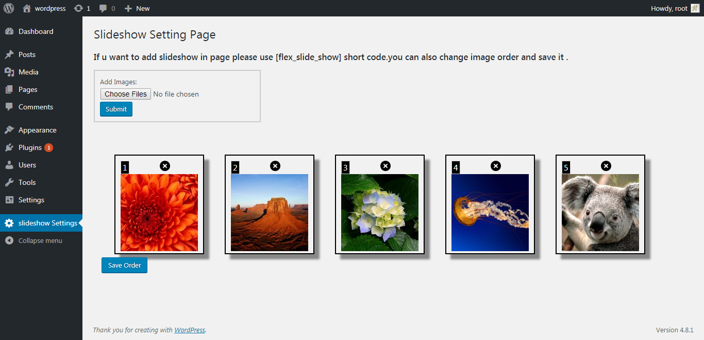
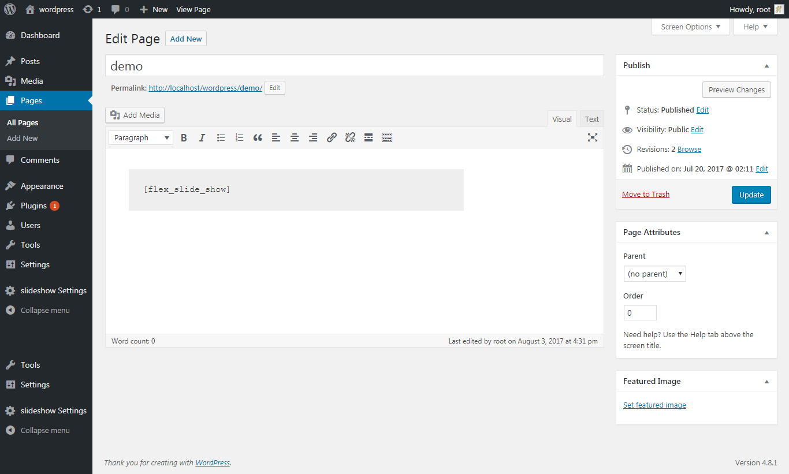
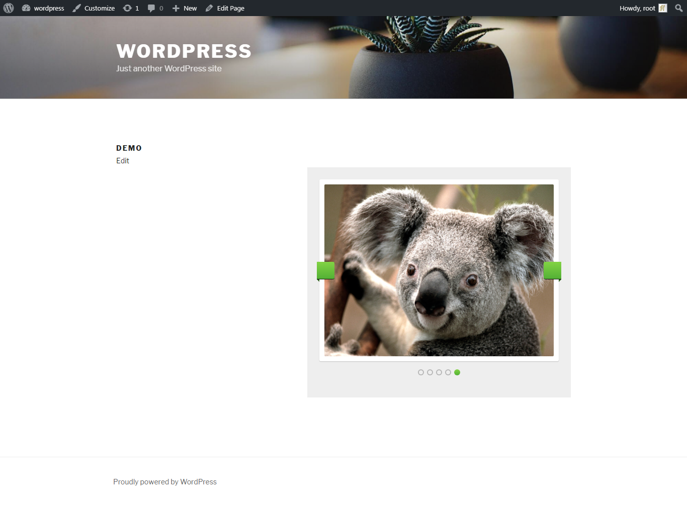

# slideshow_wp
Following plugin contain assignment given by RT-Camp for slideshow demo with ordering of slides feature and shown in frontend with the help of shortcode [front_slide_show].
## Information
**Author**: Harsiddhi Thakkar  
**Version**: 1.0  
**License**:GPL-2.0+  
## Major features
* Create a slideshow for wordpress website using short code
* Admin can reorder slides
* Admin can add multiple slides and remove slide using ajax
## Installation
1. Log in to your WordPress admin panel.
2. Download plugin from github after that Upload them to /wp-content/plugins/ directory on your WordPress installation
3. Then activate the Plugin from Plugins page.
## Library
Use Flex slider Jquery plugin from http://flexslider.woothemes.com/   
```
rtcamp_slideshow_wp_assignment
│   
│      
│
└───lib
   │   flexslider.js
   │   slider.css
   │

```
## Screenshots
  






